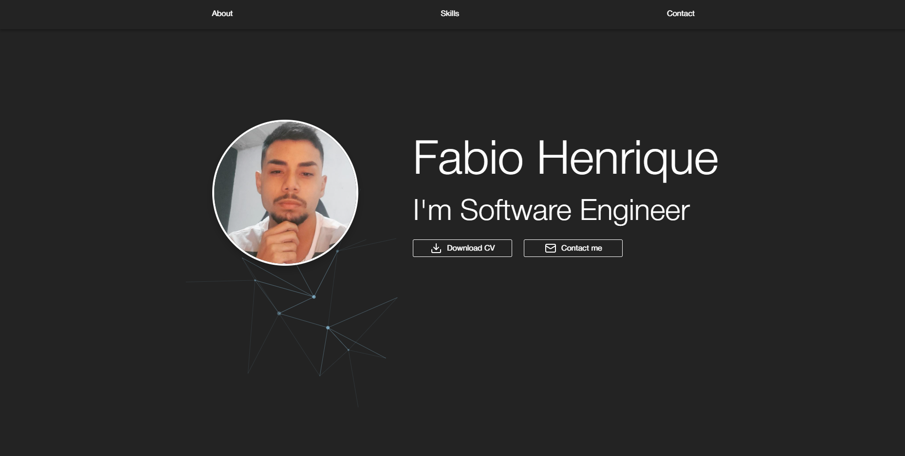

# Portfolio Project

Este é um projeto de portfólio desenvolvido utilizando **React**, **TypeScript**, **Tailwind CSS** e **Material-UI (MUI)**. O objetivo deste projeto é apresentar minhas habilidades e experiências como desenvolvedor, destacando meus projetos e fornecendo uma interface atraente e funcional.

## 🚀 Tecnologias Utilizadas

- **React**: Biblioteca JavaScript para construção de interfaces de usuário.
- **TypeScript**: Superconjunto do JavaScript que adiciona tipagem estática ao código.
- **Tailwind CSS**: Framework de utilitários para estilização rápida e customizável.
- **Material-UI (MUI)**: Biblioteca de componentes React com design moderno e acessível.

## 🎨 Funcionalidades

- **Página inicial interativa** com apresentação pessoal.
- **Sessão de Sobre** com descrição falando um pouco sobre mim.
- **Sessão de Habilidades** apresentando algumas das minhas habilidades de desenvolvimento.
- **Sessão de contato** com formulário funcional para envio de mensagens.
- Design responsivo para uma ótima experiência em diferentes dispositivos.
- Uso de componentes MUI para consistência visual e facilidade de personalização.

## 📦 Como Executar o Projeto

### Pré-requisitos

Certifique-se de ter o seguinte instalado em sua máquina:

- **Node.js** (v14 ou superior)
- **npm** ou **yarn**

### Passo a passo

1. Clone o repositório:
   ```bash
   git clone https://github.com/seu-usuario/portfolio.git
   cd portfolio
   
2. Instale as dependências:
   ```bash
   npm install
    # ou
   yarn install

3. Inicie o servidor de desenvolvimento:
   ```
   npm start
    # ou
   yarn start

4. Acesse o projeto em seu navegador no endereço:
   ```
   http://localhost:3000

📸 Prévia



Veja o projeto completo em: [Portfólio](https://portfolio-44217.web.app)


## 🔨 Estrutura do Projeto
   ```
      src/
      ├── components/       # Componentes reutilizáveis
      ├── pages/            # Páginas principais do portfólio
      ├── styles/           # Arquivos de configuração do Tailwind e estilos globais
      ├── assets/           # Imagens, ícones e outros recursos
      ├── utils/            # Funções auxiliares
      └── App.tsx           # Componente raiz da aplicação
```
## 📚 Referências
[Documentação do React]("https://react.dev")
[Documentação do TypeScript]("https://www.typescriptlang.org")
[Documentação do Tailwind CSS]("https://tailwindcss.com")
[Documentação do Material-UI]("https://mui.com")


## 🤝 Contribuições
Contribuições são bem-vindas! Se você deseja melhorar algo no projeto ou adicionar novas funcionalidades, sinta-se à vontade para enviar um pull request.


Feito com ❤️ por Fabio Henrique.
